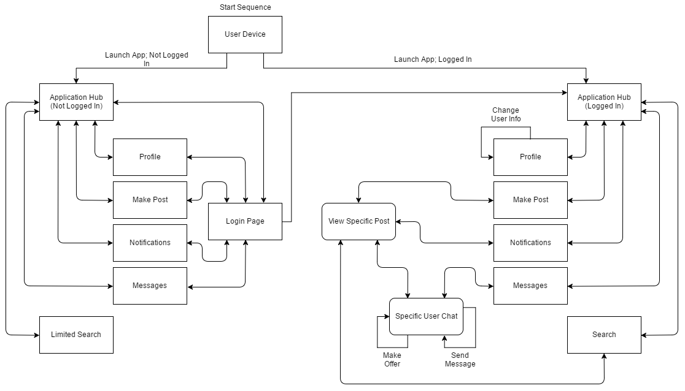

# Requirements Document

## Table of Contents
- [5.1 Introduction](#51-introduction)
- [5.2 Functional Requirements](#52-functional-requirements)
- [5.3 Performance Requirements](#53-performance-requirements)
- [5.4 Environmental Requirements](#54-environmental-requirements)

## 5.1 Introduction
This requirements specification is for MarkIt, a selling and trading application for Web access. Users will be able to sell used items to specific college communities as well as purchase these items from sellers in the application. Each user will have a profile containing basic personal information, payment preferences, a list of items the user is selling, a list of items the user has shown interest in purchasing, and a list of tags the user is interested in purchasing. Users will search for purchasable items by location, with the option of filtering by tags. A list of these items will be shown to the user. When a user finds an item they would like to purchase, they will communicate with the seller in the application using a chat system.  The remainder of this document is structured as follows: section 5.3 contains the functional requirements, section 5.4 contains the performance requirements, and section 5.5 contains the environment requirements.

## 5.2 Functional Requirements
The database shall be recreated using a more appropriate database model. The database shall be rehosted by a new service. The app should have a functioning profile page that properly pulls data from the database. The app should have a functioning hub page that properly pulls and displays dynamic data.

**5.2.1 General requirements** 
5.2.1.1 The app should have a profile page where ratings, watch lists, and tags can be viewed. 
5.2.1.2 The app shall be rehosted using a new service such as Heroku. 
5.2.1.3 The app shall no longer use Firebase, and shall use a relational database model, such as SQL. 
5.2.1.4 The app should have a hub page that dynamically loads data for the user.

**5.2.2 Profile Requirements** 
5.2.2.1 The user should be able to view another user’s profile. 
5.2.2.2 The user should be able to see what another user is currently selling. 
5.2.2.3 The user should be able to see what another user has sold in the past. 
5.2.2.4 The user shall be able to see another user’s rating. 
5.2.2.5 The user should be able to report another user.

**5.2.3 Profile Requirements** 
5.2.3.1 The user should have a dynamic and tailored hub page that properly pulls user data from the database.

## 5.3 Performance Requirements

## 5.4 Environmental Requirements
